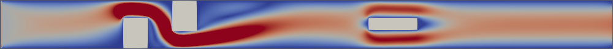

# boltzbub

…simple Lattice Boltzmann code experiments written in C++.

## Experiments

| Code                                  | Description                                                                                                    |
| -                                     | -                                                                                                              |
| `lid_driven_cavity.cc`                | Lid driven cavity using Zou/He boundary conditions for the top wall and simple bounce back for all other walls |
| `lid_driven_cavity_with_obstacles.cc` | Same as `lid_driven_cavity.cc` but includes a grid of boxes to make things more interesting                    |
| `channel.cc`                          | Channel flow some obstacles and Dirichlet inflow                                                               |

## Build

	git clone https://github.com/KnairdA/boltzbub.git
	cd boltzbub
	nix-shell
	mkdir build
	cd build
	cmake ..
	make
