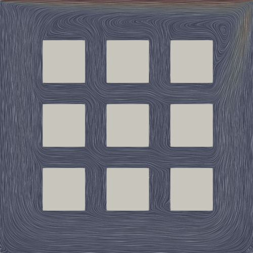

# boltzbub

…Lattice Boltzmann code experiment written in C++ that is to a full LBM code as a boy is to a man.

## Build

	git clone https://github.com/KnairdA/boltzbub.git
	cd boltzbub
	nix-shell
	mkdir --parents build/result
	cd build
	cmake ..
	make
